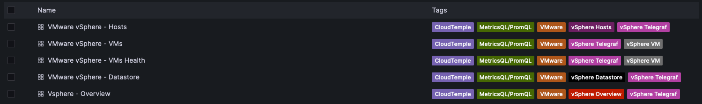
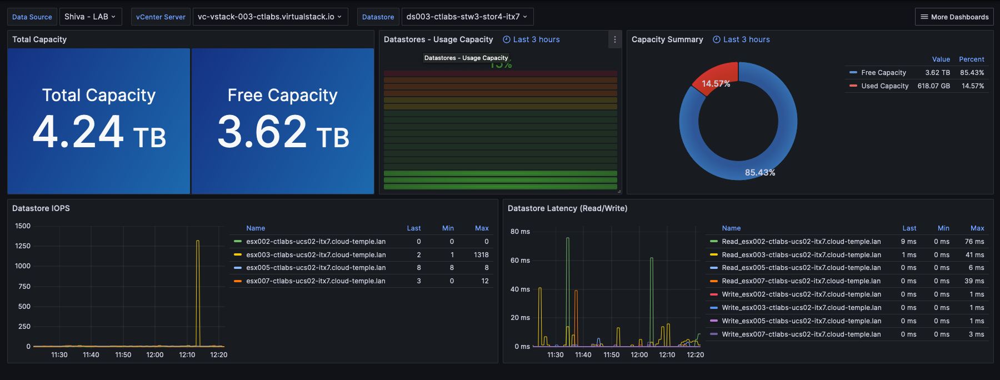
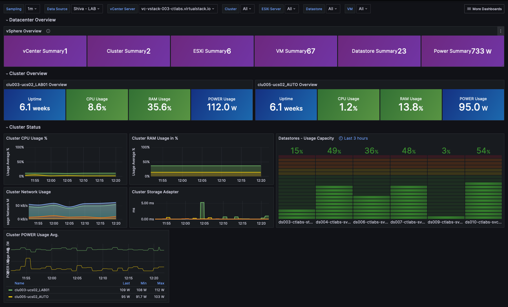
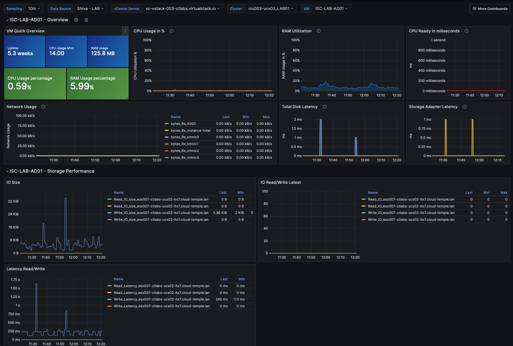
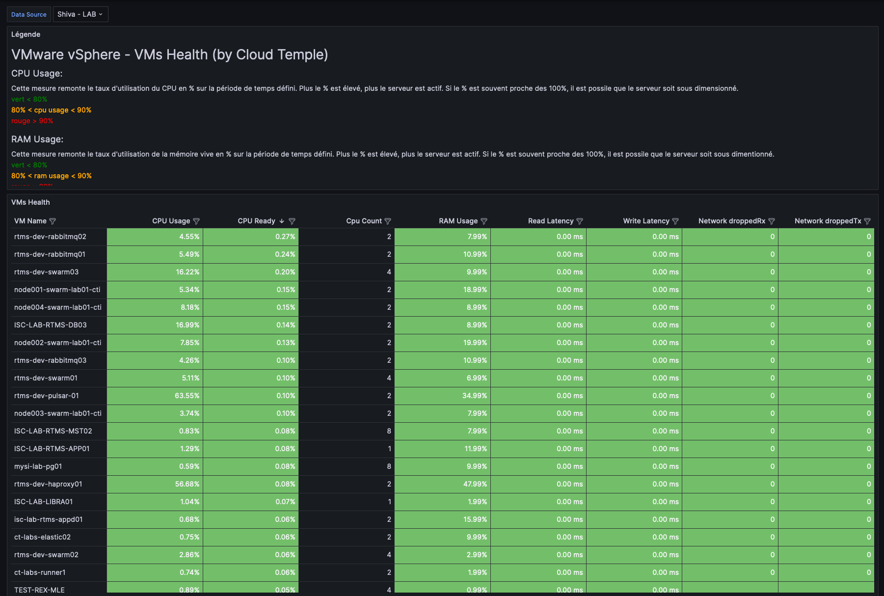

# console-grafana-iaas
Dashboard Grafana compatible with the GraphQL API of the Cloud Temple Console.

To set up a Grafana datasource, you need to follow the procedure [here](https://docs.cloud-temple.com/console/howto.en/#configuring-the-metrics-module-as-a-data-source-in-grafana)

# Module IaaS
[Templates](dashboards/iaas)

## List of IaaS Dashboards

## Datastores

## ESX

## Overview

# Virtuals Machines

# Virtuals Machines Health

***The dashboards are inspired by the work of [jorgedelacruz](https://www.jorgedelacruz.es/).***

